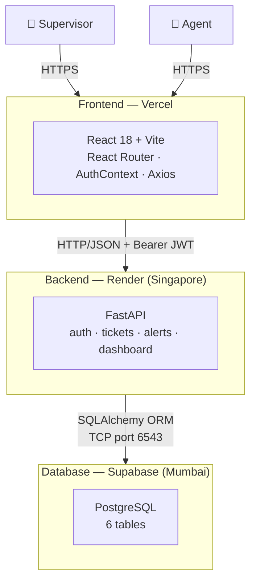
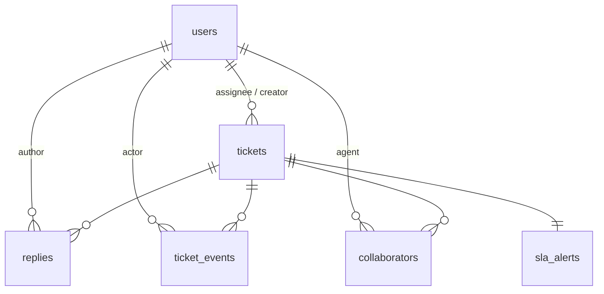
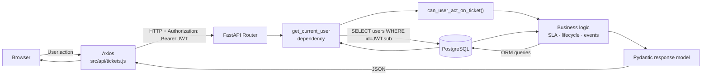
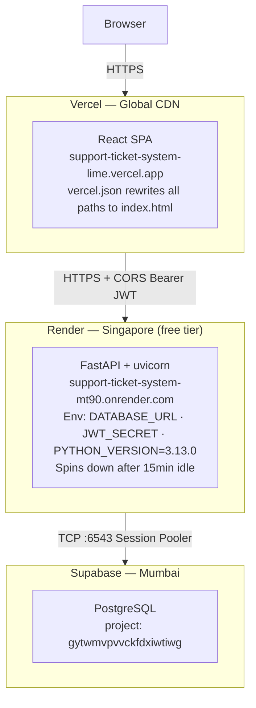
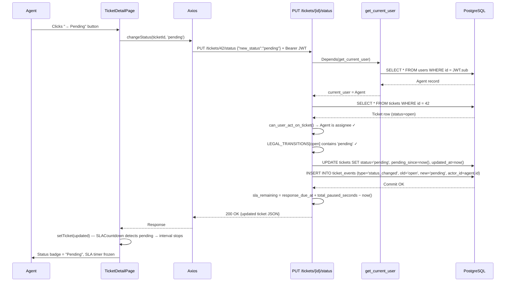

# SupportHub — Architecture
---

## 1. System Overview

SupportHub is a three-tier, role-based support ticket management system. A React SPA presents role-appropriate views to **Supervisors** and **Agents**. A FastAPI backend enforces all business rules and authorization server-side. PostgreSQL on Supabase persists all data. Customers are not users — they appear only as a `requester_name` field on tickets.



---

## 2. Moving Pieces

### Frontend

A React SPA built with Vite. Owns presentation and user interaction only — no business logic.

| Piece | Responsibility |
|-------|---------------|
| `AuthContext` | Holds JWT + decoded user; survives page refresh via `localStorage` |
| `PrivateRoute` | Redirects unauthenticated users to `/login` |
| `src/api/tickets.js` | Single Axios instance; attaches `Authorization: Bearer <token>` to every request |
| `SupervisorNav` / `AgentNav` | Role-specific navigation; both poll `GET /alerts/count` every 60s for bell badge |
| Pages (`DashboardPage`, `TicketListPage`, `WorklistPage`, `TicketDetailPage`, etc.) | Route-specific views — supervisors and agents see different pages |

### Backend

FastAPI application. All business rules, authorization, and SLA logic live here.

| Router | Prefix | Covers |
|--------|--------|--------|
| `auth.py` | `/auth` | Login, JWT issuance, `GET /auth/me` |
| `tickets.py` | `/tickets` | CRUD, status lifecycle, replies, events, collaborators, bulk actions, CSV export |
| `alerts.py` | `/alerts` | SLA alert count, list, acknowledgement |
| `dashboard.py` | `/dashboard` | Stats, 8-week resolved chart, per-agent breakdown (supervisor only) |

> **Route ordering matters:** Static routes (`/export`, `/bulk-assign`, `/meta/agents`) are registered before `/{ticket_id}` in `tickets.py`. FastAPI matches top-to-bottom; without this ordering, `"export"` is parsed as an integer and returns 422.

### Database

Six PostgreSQL tables, all created manually in Supabase (port 5432 is blocked locally; Session Pooler on 6543 is used everywhere).



| Table | Role |
|-------|------|
| `users` | Supervisors and agents only. No customer accounts. |
| `tickets` | Core entity. SLA fields (`response_due_at`, `pending_since`, `total_paused_seconds`) stored directly on the row. |
| `replies` | Append-only. `is_internal` flag separates customer-visible replies from staff notes. |
| `ticket_events` | Append-only immutable audit log. Every state change writes a row. Never updated or deleted. |
| `collaborators` | Many-to-many join. Composite PK `(ticket_id, agent_id)` prevents duplicates at DB level. |
| `sla_alerts` | One-to-one with tickets. Tracks breach acknowledgement; resets on ticket reopen. |

---

## 3. How the Pieces Communicate



**Authentication:** After login, the server returns a JWT encoding `{user_id, role}`. The frontend stores it in `localStorage` and Axios attaches it as a `Bearer` header on every request. `get_current_user` — a FastAPI dependency — decodes the token and fetches the live user record from the database before any endpoint body runs.

**Authorization:** `can_user_act_on_ticket(ticket, user, db)` is called at the top of every ticket-specific endpoint. Supervisors pass unconditionally. Agents pass only if they are the `assignee_id` or present in the `collaborators` table for that ticket.

**Frontend vs backend responsibility:**

| Frontend owns | Backend owns |
|--------------|-------------|
| Rendering, routing, local state | Business rules, validation, authorization |
| Showing only valid next-status buttons | Rejecting invalid transitions with a descriptive 400 |
| Debouncing search input (400ms) | SQL filtering, sorting, pagination |
| Pausing the SLA countdown display when status = `pending` | Computing `sla_remaining_seconds` accounting for paused time |

---

## 4. Where Each Piece Runs

### Local Development

```
localhost:5173  →  Vite dev server (React)
                   reads .env.local: VITE_API_URL=http://localhost:8000

localhost:8000  →  uvicorn app.main:app --reload (FastAPI)
                   reads .env: DATABASE_URL (Supabase:6543), JWT_SECRET

Supabase        →  PostgreSQL (cloud, always-on, accessed via Session Pooler :6543)
```

### Production



> **Vercel SPA routing:** React Router handles paths like `/dashboard` client-side. Without a rewrite rule, Vercel returns 404 for these paths. `frontend/vercel.json` rewrites every path to `index.html`, letting React Router take over in the browser.

> **Render cold start:** Free tier sleeps after 15 minutes of inactivity. First request after idle takes ~30–60 seconds.

---

## 5. Representative End-to-End Request

### "Agent changes ticket status to Pending"

This action crosses authentication, authorization, lifecycle validation, SLA pause logic, event logging, and frontend state update — the most complete path through the architecture.



**What each layer does and why:**

- **Axios** — attaches the JWT so the backend knows who is acting
- **`get_current_user`** — resolves a live user record; expired/invalid tokens stop here with 401
- **`can_user_act_on_ticket()`** — single source of truth for ticket-level authorization; 403 if agent is neither assignee nor collaborator
- **`LEGAL_TRANSITIONS`** — dict of `{status → [allowed next]}` enforced server-side regardless of what the frontend sends
- **SLA pause** — `pending_since = now()` records when Pending began; on exit, `total_paused_seconds += (now() − pending_since)`, extending the effective deadline so agents are not penalised for customer wait time
- **`ticket_events` insert** — immutable audit row written in the same transaction as the status update
- **`SLACountdown`** — freezes its 1-second JavaScript interval when `ticketStatus === 'pending'`, mirroring the backend's paused calculation

---

## 6. What We Deliberately Did Not Build

| Boundary | Rationale |
|----------|-----------|
| **Customer authentication / portal** | Customers are external actors; defined in scope as a `requester_name` field only. A full customer login would require a separate auth flow, scoped data access, and notification infrastructure. |
| **Email ingestion / notifications** | Creating tickets from inbound email requires an SMTP/webhook pipeline; outbound notifications require a mail provider. Neither is in scope. Agents create tickets manually; SLA alerts provide in-app urgency signals. |
| **WebSockets / real-time push** | Polling `GET /alerts/count` every 60s is sufficient for the single-team use case. WebSocket connection management adds complexity without meaningful benefit at this scale. |
| **File/attachment storage** | Tickets carry text only. Attachments require object storage, upload endpoints, and content-type handling — a distinct infrastructure concern outside the current scope. |
| **Password reset** | No email delivery is configured, so no reset link can be delivered. Credentials are seeded directly into the database. |

---

## 7. Architecture Summary

SupportHub is a three-tier web application with a strict separation of concerns. The React frontend owns presentation and navigation; FastAPI owns all business logic, validation, and authorization; PostgreSQL owns persistence. JWT-based authentication flows through every protected request via a shared `get_current_user` FastAPI dependency. Role and ticket-level authorization is enforced server-side in all cases — the frontend reflects permissions, it does not enforce them. The SLA engine, lifecycle validation, immutable audit log, and server-side filtering are all backend concerns. Frontend and backend are deployed independently — Vercel for the SPA, Render for the API, Supabase for the database — communicating over HTTPS with CORS configured explicitly.
