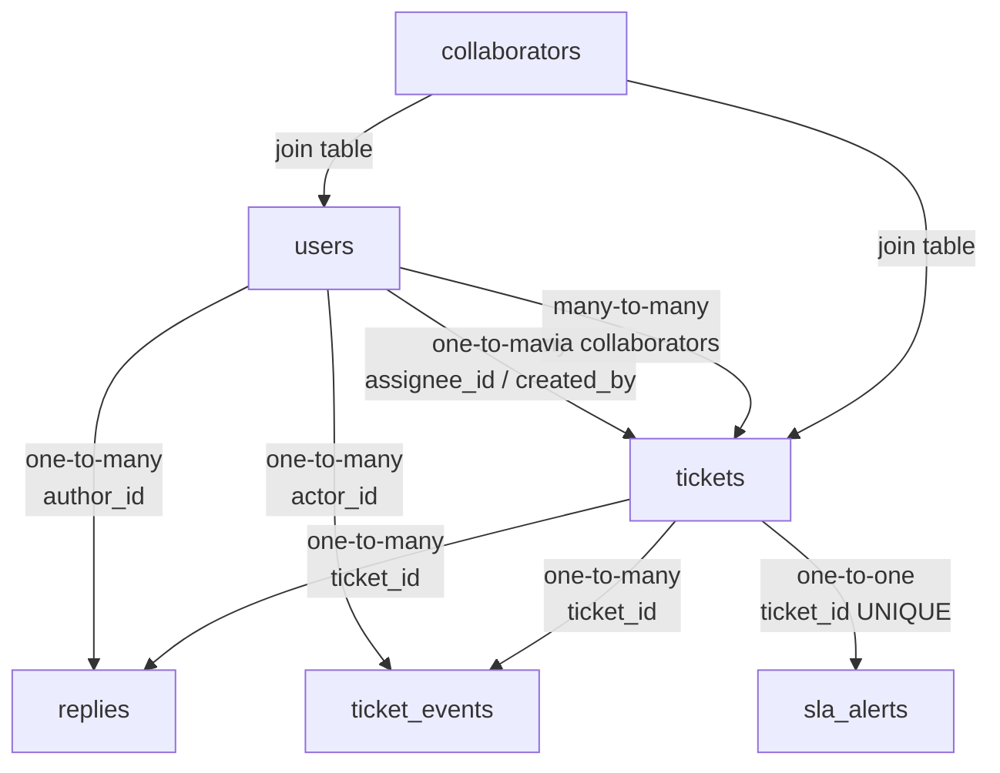
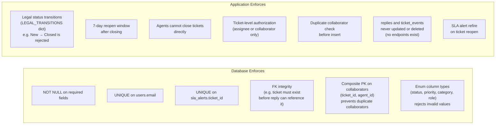

# Database Schema — SupportHub

This document covers every table's structure, the relationships between them, which constraints live in the database versus the application layer, what was deliberately denormalised and why, and what would degrade first under significantly higher data volume.

---

## 1. Overview

SupportHub uses six PostgreSQL tables. The schema is relational and normalised — no data is duplicated except where a deliberate denormalisation decision was made (documented in Section 5).

All six tables were created manually via raw SQL in the Supabase dashboard. `Base.metadata.create_all()` is commented out in `main.py` because the local network blocks port 5432 at startup.

> **ER Diagram**
> 

---

## 2. Table Reference

### `users`

Stores all system users — supervisors and agents. Customers are not in this table; they exist only as a `requester_name` string on a ticket.

| Column | Type | Constraints | Notes |
|--------|------|-------------|-------|
| `id` | `integer` | PK, auto-increment | |
| `email` | `varchar` | NOT NULL, UNIQUE | Used as login identifier |
| `password_hash` | `varchar` | NOT NULL | Argon2 hash — never stored plain |
| `name` | `varchar` | NOT NULL | Display name shown in UI |
| `role` | `enum` | NOT NULL | `supervisor` or `agent` |
| `created_at` | `timestamp` | NOT NULL, default `now()` | |
| `is_active` | `boolean` | NOT NULL, default `true` | Reserved for future deactivation |

---

### `tickets`

The core entity. Contains all ticket data plus three SLA-tracking fields that are updated in real time as status changes.

| Column | Type | Constraints | Notes |
|--------|------|-------------|-------|
| `id` | `integer` | PK, auto-increment | |
| `subject` | `varchar` | NOT NULL | Short title |
| `description` | `text` | NOT NULL | Full problem description |
| `requester_name` | `varchar` | NOT NULL | Customer name — no FK, customers don't log in |
| `priority` | `enum` | NOT NULL | `critical` / `high` / `medium` / `low` |
| `category` | `enum` | NOT NULL | `billing` / `technical` / `how_to` / `account` / `feature_request` / `other` |
| `status` | `enum` | NOT NULL, default `new` | `new` / `open` / `pending` / `resolved` / `closed` |
| `assignee_id` | `integer` | FK → `users.id`, NOT NULL | Primary assignee |
| `created_by` | `integer` | FK → `users.id`, NOT NULL | Who created the ticket |
| `created_at` | `timestamp` | NOT NULL, default `now()` | Immutable after creation |
| `updated_at` | `timestamp` | NOT NULL | Updated on every change |
| `closed_at` | `timestamp` | nullable | Set when status → `closed` |
| `response_due_at` | `timestamp` | nullable | SLA deadline: `created_at + SLA_HOURS[priority]` |
| `pending_since` | `timestamp` | nullable | Set when entering Pending, cleared on exit |
| `total_paused_seconds` | `float` | NOT NULL, default `0.0` | Accumulated pause time across all Pending periods |
| `archived` | `boolean` | NOT NULL, default `false` | Soft delete — hidden from queues, data preserved |

**SLA fields explained:** `response_due_at` is set at creation and adjusted when priority changes. `pending_since` records exactly when the ticket entered Pending. When the ticket leaves Pending, `total_paused_seconds += (now() - pending_since)`. Effective remaining SLA = `response_due_at + total_paused_seconds - now()`. This computation requires no joins.

---

### `replies`

Append-only. Every message on a ticket — whether customer-visible or internal — is stored here. No UPDATE or DELETE operations exist for this table.

| Column | Type | Constraints | Notes |
|--------|------|-------------|-------|
| `id` | `integer` | PK, auto-increment | |
| `ticket_id` | `integer` | FK → `tickets.id`, NOT NULL | |
| `author_id` | `integer` | FK → `users.id`, NOT NULL | |
| `body` | `text` | NOT NULL | Reply content |
| `is_internal` | `boolean` | NOT NULL, default `false` | `true` = staff-only note (amber UI tint) |
| `created_at` | `timestamp` | NOT NULL, default `now()` | Immutable |

---

### `ticket_events`

Append-only immutable audit log. Every state-changing action writes a row here — status changes, reassignments, replies added, collaborator changes, archive/restore. No UPDATE or DELETE ever touches this table.

| Column | Type | Constraints | Notes |
|--------|------|-------------|-------|
| `id` | `integer` | PK, auto-increment | |
| `ticket_id` | `integer` | FK → `tickets.id`, NOT NULL | |
| `event_type` | `enum` | NOT NULL | See event types below |
| `old_value` | `varchar` | nullable | Human-readable previous value |
| `new_value` | `varchar` | nullable | Human-readable new value |
| `actor_id` | `integer` | FK → `users.id`, NOT NULL | Who performed the action |
| `created_at` | `timestamp` | NOT NULL, default `now()` | |

**Event types:**

| Value | Triggered by |
|-------|-------------|
| `ticket_created` | New ticket saved |
| `status_changed` | Any status transition |
| `reassigned` | Assignee changed |
| `collaborator_added` | Collaborator added |
| `collaborator_removed` | Collaborator removed |
| `reply_added` | Customer reply or internal note posted |
| `ticket_archived` | Ticket archived |
| `ticket_restored` | Archived ticket restored |

`old_value` and `new_value` store human-readable strings, not foreign key IDs, so the timeline is readable without joins (`old_value: "open"`, `new_value: "pending"`).

---

### `collaborators`

Many-to-many join table between tickets and agents. A ticket can have multiple collaborators; an agent can collaborate on multiple tickets.

| Column | Type | Constraints | Notes |
|--------|------|-------------|-------|
| `ticket_id` | `integer` | PK, FK → `tickets.id` | Composite PK prevents duplicates at DB level |
| `agent_id` | `integer` | PK, FK → `users.id` | |
| `added_at` | `timestamp` | NOT NULL, default `now()` | |

The composite primary key `(ticket_id, agent_id)` means the database will reject a duplicate collaborator insert without any application-level check being needed. The application also checks for duplicates before inserting, but the DB is the final enforcer.

---

### `sla_alerts`

One-to-one with tickets. Tracks whether an SLA breach alert has been acknowledged by the assigned agent. The `acknowledged` flag resets to `false` if a closed ticket is later reopened and breaches its SLA again.

| Column | Type | Constraints | Notes |
|--------|------|-------------|-------|
| `id` | `integer` | PK, auto-increment | |
| `ticket_id` | `integer` | FK → `tickets.id`, UNIQUE | One alert record per ticket |
| `acknowledged` | `boolean` | NOT NULL, default `false` | `true` = agent dismissed the alert |
| `created_at` | `timestamp` | NOT NULL, default `now()` | When the alert was first created |
| `acknowledged_at` | `timestamp` | nullable | When acknowledged — cleared on refire |

The `UNIQUE` constraint on `ticket_id` enforces the one-to-one relationship at the database level.

---

## 3. Relationships

| Relationship | Type | FK Column(s) |
|-------------|------|-------------|
| `users` → `tickets` (as assignee) | one-to-many | `tickets.assignee_id → users.id` |
| `users` → `tickets` (as creator) | one-to-many | `tickets.created_by → users.id` |
| `tickets` → `replies` | one-to-many | `replies.ticket_id → tickets.id` |
| `tickets` → `ticket_events` | one-to-many | `ticket_events.ticket_id → tickets.id` |
| `tickets` → `sla_alerts` | one-to-one | `sla_alerts.ticket_id → tickets.id` (UNIQUE) |
| `users` ↔ `tickets` (collaboration) | many-to-many | via `collaborators(ticket_id, agent_id)` |

---

## 4. Constraints: Database vs Application

Some rules are enforced by the database itself; others are enforced by the FastAPI application layer. The split is intentional.

**Why this split?**

Database constraints handle structural integrity — things that should *never* be possible regardless of how the application is called. If a FK constraint didn't exist, a reply could reference a ticket that was deleted; the UI would break silently.

Application constraints handle business rules — things that are structurally valid data but violate the workflow. A status jump from `new` to `closed` is valid data (both are legitimate enum values), but it's an illegal business operation. That check belongs in the code, not the schema.

| Constraint | Where enforced | Why |
|-----------|---------------|-----|
| Ticket must exist before reply | Database (FK) | Structural integrity |
| User must exist before ticket | Database (FK) | Structural integrity |
| Duplicate collaborator prevented | **Both** | DB composite PK is final; app checks first for a clean error message |
| SLA alert one-per-ticket | Database (UNIQUE) | Structural — one alert record maximum |
| `new → closed` rejected | Application | Business rule — structurally valid, operationally illegal |
| 7-day reopen window | Application | Business rule — depends on elapsed time, not structure |
| Replies never deleted | Application | No delete endpoint exists — not a DB trigger |
| `ticket_events` never modified | Application | No update/delete endpoints — not a DB trigger |

---

## 5. Denormalisation Decisions

The schema is largely normalised. Two deliberate exceptions:

### SLA fields stored on `tickets`, not computed from `ticket_events`

`response_due_at`, `pending_since`, and `total_paused_seconds` live directly on the `tickets` row.

The fully normalised alternative would be to derive these by scanning `ticket_events` — find the `ticket_created` event for the start time, find all `status_changed` events for pending periods, and compute the duration programmatically.

That approach was rejected because: (a) SLA remaining is computed on every ticket list load — 20 tickets per page means 20 computations, and scanning event history for each is expensive; (b) any gap or ordering issue in the events table would silently corrupt SLA numbers. Storing the fields directly makes SLA computation a single arithmetic expression with no joins. The trade-off is that these fields must be updated correctly on every status transition, which is handled in `change_ticket_status()`.

### `old_value` and `new_value` in `ticket_events` are human-readable strings, not FKs

A fully normalised design would store foreign key IDs — `old_value = 3` (meaning `status_id = 3`) rather than `old_value = "open"`. The timeline endpoint would then JOIN to resolve these into readable labels.

Storing strings directly was chosen because: the timeline is read-only and display-only — it never needs to be filtered or aggregated by these values. The overhead of joining to resolve display strings is pure cost with no benefit. If `old_value = "open"` gets stored and the enum label changes in future, it's a documentation problem, not a data integrity problem. The simplicity of string storage is worth the minor normalisation violation here.

---

## 6. What Would Break First at 100x Data

At current scale (~50 tickets, 5 users), no query is under meaningful load. At 100x (5,000+ tickets, 500+ users, potentially 50,000+ events), these are the likely failure points in order of impact:

| Bottleneck | Why It Breaks | Fix |
|-----------|--------------|-----|
| `GET /tickets/` full table scan | Every page load queries the full `tickets` table with `WHERE + ORDER BY + LIMIT`. Without indexes on `status`, `priority`, `assignee_id`, and `updated_at`, PostgreSQL scans every row. | Add composite indexes on common filter combinations: `(status, assignee_id)`, `(priority, status)`, `updated_at DESC` |
| `ticket_events` scans | The timeline endpoint does `SELECT * FROM ticket_events WHERE ticket_id = ?`. Without an index on `ticket_id`, this is a full table scan across tens of thousands of rows. | Index on `(ticket_id, created_at)` |
| SLA remaining computed per-request | `compute_sla_remaining()` runs on every ticket in every list response. At 20 tickets per page × frequent refreshes, this stays fast — but has no caching. | Materialized view updated on status change, or cache the computed value in Redis |
| `sla_alerts` background check | Currently alerts are checked reactively (when a ticket is loaded). A proper background job scanning all tickets for breaches would need to run efficiently. | Scheduled task with an index on `response_due_at` |
| No soft-delete index | `WHERE archived = false` filters every query. Without a partial index on `archived`, this condition touches every row. | Partial index: `CREATE INDEX ON tickets (id) WHERE archived = false` |

The two most impactful immediate fixes would be indexes on `tickets(status, assignee_id, updated_at)` and `ticket_events(ticket_id, created_at)`. These alone would handle the majority of the query load at 100x volume.
